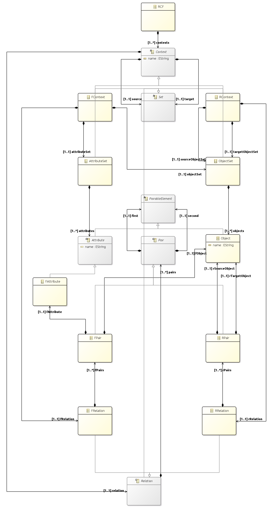
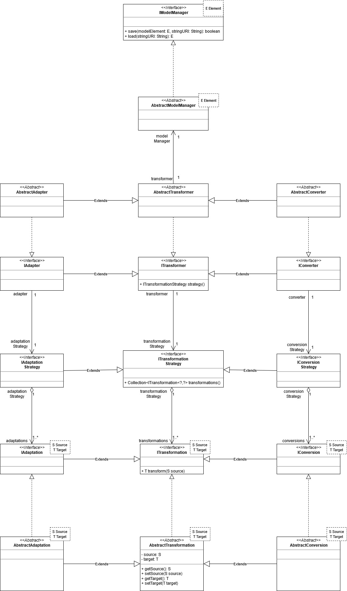

# Introduction
This project defines UML-to-RCA metamodel transformations. It introduces a generic metamodel transformation architecture and specializes it into the UML-to-RCA use-case. It then uses data provided by the Knowmana project to validate both the architecture and the defined transformations. It relies on the RCA metamodel (*as provided by the rca project available at* https://github.com/anonbnr/rca) and the UML2 metamodel (*as provided by the* `org.eclipse.uml2.uml` *package*).

# RCA (Relational Context Analysis)
## Introduction
**RCA** is an extension of **FCA** (**Formal Context Analysis**) for relational datasets. It allows taking relationships between different categories of objects into consideration throughout the analysis, where each object category is represented by a **concept lattice**, and each relationship is represented by a directed binary link between two lattices, source and target. Relationships between lattices are materialized through relational attributes, integrated to source objects and pointing to concepts in the target lattices.

Underlying RCA is an iterative process aiming to refine the relationships between concept lattices, by adding relational attributes to objects of source lattices using **scaling operators**, and discovering new concepts at each iteration, until no new concept can be discovered. At the end of the process, a set of interconnected concept lattices is obtained, which can be represented in a hierarchy of ontological concepts that and can be examined and analyzed using some knowledge representation formalism (e.g. description logic).

RCA can be very useful in software engineering, knowledge representation, artificial intelligence, $\dots$ Some applications include refactoring UML class and use case diagrams, extracting OO architectures, web service classification, construction and extraction of ontologies, $\dots$

## RCF (Relational Context Family)
*TODO*

## Relational Scaling
*TODO*

## Algorithm
*TODO*

# The RCA Metamodel
Based on the brief aforementioned introduction to RCA, the following metamodel has been crafted to describe its entities and associations.

## The Core viewpoint
*TODO*

### Description
*TODO*

## The Formal Context viewpoint
*TODO*

### Description
*TODO*

## The Relation Context viewpoint
*TODO*

### Description
*TODO*

## The Global viewpoint

# The Generic Metamodel Transformation Architecture
## Introduction
*TODO*

## Transformations, Transformation strategies, and Transformers
*TODO*

## Adaptations, Adaptation strategies, and Adapters
*TODO*

## Conversions, Conversion strategies, and Converters
*TODO*

## Model Management
*TODO*

# The UML-to-RCA use-case
## Introduction
*TODO*

## Adaptations (X-UML to R-UML)
*TODO*

## Conversions (R-UML to RCF)
*TODO*

## Instance migrations (populating the RCF)

# Environment Configuration
1. install Eclipse IDE pre-bundled with the Eclipse Modeling Tools: https://www.eclipse.org/downloads/packages/release/2020-03/r/eclipse-modeling-tools
1. once Eclipse IDE is installed, from the workspace, `File` $\rightarrow$ `New` $\rightarrow$ `Other` $\dots$ $\rightarrow$ `Eclipse Modeling Framework` $\rightarrow$ `Ecore Modeling Project`, then follow the installation wizard.
1. The RCA metamodel project (*whose GitHub repository' links is provided in the Introduction*) should be added as a project dependency to the project's build path.
1. The `Papyrus` project must be installed and used to create, visualize, import and export the `.uml` model files, instead of using the `Ecore Modeling Editor`. The installation is done as follows: `Help` $\rightarrow$ `Eclipse Marketplace` $\rightarrow$ search for `Papyrus Software Designer` in `All Available Markets` $\rightarrow$ install `Papyrus Software Designer 1.1.0` $\rightarrow$ `Restart Eclipse`.
1. Along with the already imported plugin dependencies, the following jars must be added as external jars manually to the project's build path (*they usually reside in the* `plugins/` *folder of the eclipse IDE installation folder*):
    - `org.eclipse.uml2.uml.profile.standard_1.5.0.v20200302-1312`
    - `org.eclipse.uml2.uml.resources_5.5.0.v20200302-1312`
1. The `Apache Commons Lang` bundle of utility classes must also be added as an external library to the project's build path:
    - **download link**: https://mvnrepository.com/artifact/org.apache.commons/commons-lang3/3.10
    - **note**: preferrably to be added to the `plugins/` folder of the eclipse IDE installation folder.
